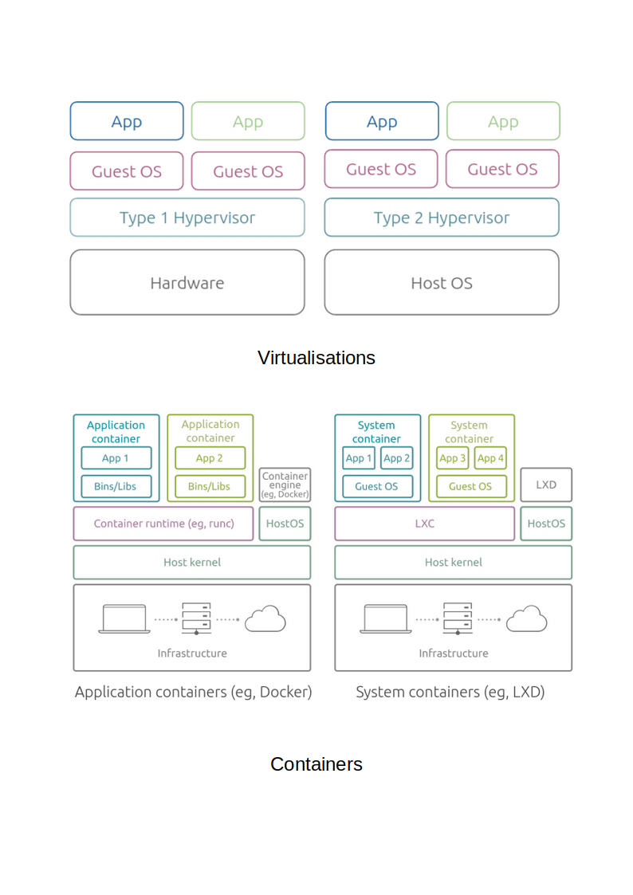

# Overview

This project contains demonstrators and references to general container (non-Docker) technologies.

## Concept

Containers are technologies that allow the packaging and isolation of applications with their entire runtime environment—all of the files necessary to run[1](https://www.redhat.com/en/topics/containers).

<u>Virtualisations versus containers</u>

Please refer to [Containerization vs. Virtualization : understand the differences](https://ubuntu.com/blog/containerization-vs-virtualization) by Miona Aleksic

## Disclaimer

* The content of this project are intended for educational purpose only.
* The content is constantly updated and items may be removed and modified without warning.

## Copyright

Unless otherwise specified, the copyright in this project are assigned as follows.

Copyright 2023 Paul Sitoh

Licensed under the Apache License, Version 2.0 (the "License"); you may not use this file except in compliance with the License. You may obtain a copy of the License at

http://www.apache.org/licenses/LICENSE-2.0
Unless required by applicable law or agreed to in writing, software distributed under the License is distributed on an "AS IS" BASIS, WITHOUT WARRANTIES OR CONDITIONS OF ANY KIND, either express or implied. See the License for the specific language governing permissions and limitations under the License.